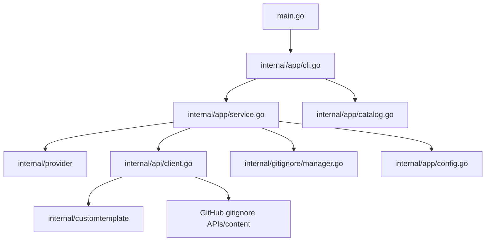

<!-- generated-by: gsd-doc-writer -->

# Architecture

## System overview

`genignore` is a layered Go CLI that analyzes the current working directory for provider signals, resolves a deterministic provider set, fetches `.gitignore` template content from `github/gitignore` (plus embedded local templates), and updates only the managed marker block in `.gitignore` so user-owned lines outside the markers are preserved.

## Component diagram



## Data flow

1. Process entry starts in `main.go`, which calls `app.Run(os.Args[1:])`.
2. `internal/app/cli.go` initializes runtime validation (`runtimeInitError`), loads machine config (`LoadConfig`), and builds Cobra commands: `detect`, `add`, `list`, and `search`.
3. `detect` and `add` commands delegate to `Service` methods in `internal/app/service.go`.
4. For detection, `Service.scanTarget` iterates detectors from `provider.Registry()` in sorted key order, collects `provider.Result` entries, and derives matched providers.
5. `Service.detectFinalProviders` merges detected providers with include/exclude/default inputs, then sorts to keep output stable.
6. `internal/api/client.go` resolves remote template paths from the GitHub tree API, downloads template parts from raw content URLs, and appends embedded custom template content from `internal/customtemplate` when selected.
7. `internal/gitignore/manager.go` builds a normalized managed block (`BuildManagedBlock`) and upserts it into `.gitignore` (`UpsertManagedBlock`) as `created`, `updated`, `no-op`, or `dry-run`.
8. CLI output is rendered either as JSON (`--json`) or human-readable terminal output (Lipgloss labels), including warnings and file action status.

For provider discovery commands, `internal/app/catalog.go` retrieves remote providers, appends embedded custom provider keys, sorts/deduplicates, and optionally filters with substring matching for `search`.

## Key abstractions

- `Run(args []string) int` — top-level CLI bootstrap and command execution (`internal/app/cli.go`).
- `type commandService interface` — command-layer contract exposing `Detect` and `Add` (`internal/app/cli.go`).
- `type Service struct` — orchestration boundary combining config, detectors, API client, and file manager (`internal/app/service.go`).
- `type DetectOptions` / `type AddOptions` — execution-time options passed from CLI to service (`internal/app/service.go`).
- `type APIClient interface` — service-facing abstraction for catalog and template retrieval (`internal/app/service.go`).
- `type Client struct` + `FetchTemplate` / `AvailableProviders` — HTTP-backed provider catalog and template fetcher with in-memory catalog cache (`internal/api/client.go`).
- `type Detector interface` and `type Result` — provider detection contract and normalized detection output (`internal/provider/provider.go`).
- `func Registry() map[string]Detector` — detector registry for runtime, filesystem, project, and installed-tool signals (`internal/provider/detectors.go`).
- `type Manager struct` + `BuildManagedBlock` / `UpsertManagedBlock` — managed marker block assembly and safe merge semantics for `.gitignore` (`internal/gitignore/manager.go`).
- `type Config` / `type ConfigDefaults` + `LoadConfig()` — TOML-backed machine defaults loader from `~/.config/genignore/config.toml` (`internal/app/config.go`).
- `type Definition`, `ProviderKeys()`, and `ContentForProviders()` — embedded custom-template registry and content loader (`internal/customtemplate/definitions.go`, `internal/customtemplate/registry.go`).

## Directory structure rationale

The repository uses a thin entrypoint and focused internal packages so each concern (command surface, orchestration, detection, remote retrieval, and file mutation) remains isolated and testable.

```text
.
├── main.go                  # Minimal process entrypoint delegating to app.Run
├── internal/
│   ├── app/                 # CLI wiring, result types, config loading, and orchestration services
│   ├── api/                 # GitHub catalog/template client and decoding logic
│   ├── provider/            # Supported key set and detector implementations
│   ├── gitignore/           # Managed marker block building and file upsert behavior
│   └── customtemplate/      # Embedded non-remote templates and registry
├── docs/                    # Project documentation
├── .github/                 # CI/release automation metadata
└── .planning/               # Local planning artifacts
```

This package layout keeps command handling in `app`, provider inference in `provider`, remote content retrieval in `api`, and disk mutation safety in `gitignore`, which minimizes coupling and keeps behavior deterministic.
