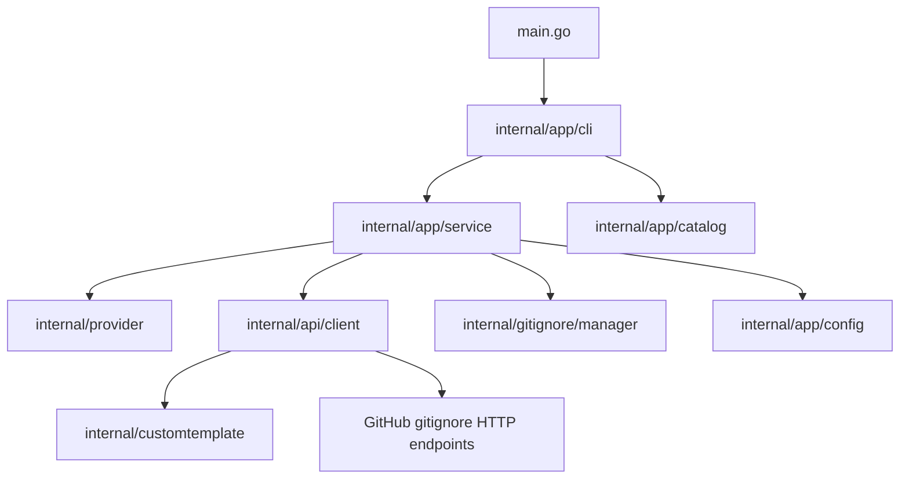

<!-- generated-by: gsd-doc-writer -->

# Architecture

## System overview

`genignore` is a single-binary, layered Go CLI that detects technology providers from the current working directory, resolves the final provider set (detected + include/exclude/default overrides), fetches matching templates from `github/gitignore` (plus embedded custom templates), and upserts only the managed marker block in `.gitignore` while preserving all user-owned content outside that block.

## Component diagram



## Data flow

1. `main.go` calls `app.Run(os.Args[1:])`.
2. `internal/app/cli.go` builds the Cobra command tree (`detect`, `add`, `list`, `search`) and parses flags.
3. For `detect`/`add`, CLI delegates to `internal/app/service.go`.
4. In `detect`, `Service.scanTarget` runs provider detectors from `internal/provider` and sorts results deterministically.
5. `Service.detectFinalProviders` merges detected providers with `--include` and `--exclude`, then sorts the final set (config defaults are applied earlier in `Service.Detect`).
6. `internal/api/client.go` fetches remote template catalog/content from GitHub and merges embedded custom template content from `internal/customtemplate` when applicable.
7. `internal/gitignore/manager.go` builds normalized managed block content and `UpsertManagedBlock` either creates, updates, dry-runs, or no-ops `.gitignore`.
8. CLI renders either JSON output or styled human-readable output (Lipgloss), including warnings and file action status.

For `list`/`search`, `internal/app/catalog.go` fetches available providers from the catalog client, appends embedded custom providers, sorts, and optionally filters by search term.

## Key abstractions

- `Run(args []string)` — CLI entrypoint that initializes runtime checks, config, commands, and output routing (`internal/app/cli.go`).
- `type commandService interface` — CLI-to-service contract for `Detect` and `Add` command execution (`internal/app/cli.go`).
- `type Service struct` — Application orchestration layer combining config, detector registry, API client, and gitignore manager (`internal/app/service.go`).
- `type APIClient interface` — Service-facing abstraction for provider catalog/template retrieval (`internal/app/service.go`).
- `type Detector interface` and `type Result` — Provider detection contract and normalized detector output (`internal/provider/provider.go`).
- `func Registry() map[string]Detector` — Central detector registry for runtime/provider/environment signals (`internal/provider/detectors.go`).
- `type Client struct` and `type TemplateResponse` — Remote catalog/template fetcher with in-process catalog cache and merged template output (`internal/api/client.go`).
- `type Manager struct` plus `BuildManagedBlock` / `UpsertManagedBlock` — Managed `.gitignore` block generation and safe replacement semantics (`internal/gitignore/manager.go`).
- `type Config` / `type ConfigDefaults` and `LoadConfig()` — Machine-level TOML defaults loader (`internal/app/config.go`).
- `type Definition` and custom template registry (`ProviderKeys`, `ContentForProviders`) — Embedded template extension point for non-remote providers (`internal/customtemplate/definitions.go`, `internal/customtemplate/registry.go`).

## Directory structure rationale

The project is organized as a thin executable entrypoint plus focused internal packages so that command parsing, orchestration, detection, remote fetching, and file mutation are separated and testable in isolation.

```text
.
├── main.go                      # Minimal process entrypoint; delegates to app.Run
├── internal/
│   ├── app/                     # CLI command wiring, config loading, service orchestration, output contracts
│   ├── api/                     # GitHub-backed provider catalog + template HTTP client
│   ├── provider/                # Provider support list and detector implementations/registry
│   ├── gitignore/               # Managed marker block build/merge and .gitignore file actions
│   └── customtemplate/          # Embedded custom provider templates and registration
├── docs/                        # Generated project documentation
└── .github/                     # Repository automation/workflow configuration
```

This layout keeps domain boundaries explicit: `app` orchestrates, `provider` decides what to include, `api` supplies template content, and `gitignore` owns on-disk mutation rules.
