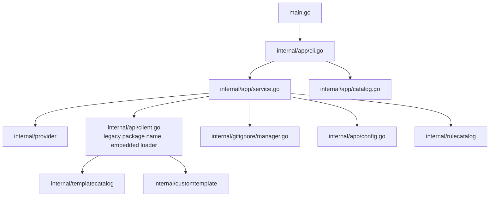

# Architecture

## System overview

`genignore` is a layered Go CLI that analyzes the current working directory for provider signals, resolves a deterministic provider set, loads `.gitignore` template content from embedded `github/gitignore` snapshot data plus embedded local templates, and updates only the managed marker block in `.gitignore` so user-owned lines outside the markers are preserved.

## Component diagram


```mermaid
graph TD
  A[main.go] --> B[internal/app/cli.go]
  B --> C[internal/app/service.go]
  B --> D[internal/app/catalog.go]
  C --> E[internal/provider]
  C --> F[internal/api/client.go\nlegacy package name, embedded loader]
  C --> G[internal/gitignore/manager.go]
  C --> H[internal/app/config.go]
  C --> I[internal/rulecatalog]
  F --> J[internal/templatecatalog]
  F --> K[internal/customtemplate]
```

## Data flow

1. Process entry starts in `main.go`, which calls `app.Run(os.Args[1:])`.
2. `internal/app/cli.go` loads machine config (`LoadConfig`) and builds Cobra commands: `resolve`, `detect`, `add`, `doctor`, `list`, and `search`.
3. `detect` and `add` commands delegate to `Service` methods in `internal/app/service.go`.
4. For detection, `Service.scanTarget` iterates detectors from `provider.Registry()` in sorted key order, collects `provider.Result` entries, and derives matched providers.
5. `Service.detectFinalProviders` merges detected providers with include/exclude/default inputs, then sorts to keep output stable.
6. `internal/api/client.go` retains a legacy package name, but its implementation is now an embedded catalog/template loader: it reads provider content from `internal/templatecatalog` and appends embedded custom template content from `internal/customtemplate` when selected.
7. `internal/rulecatalog` loads the embedded JSON repository-rule catalog used by repository-backed detectors and `doctor` diagnostics.
8. `internal/gitignore/manager.go` builds a normalized managed block (`BuildManagedBlock`) and upserts it into `.gitignore` (`UpsertManagedBlock`) as `created`, `updated`, `no-op`, or `dry-run`.
9. CLI output is rendered either as JSON (`--json`) or human-readable terminal output, including warnings, doctor diagnostics, provenance, and file action status.

For provider discovery commands, `internal/app/catalog.go` reads the embedded provider catalog, appends embedded custom provider keys, sorts/deduplicates, and optionally filters with substring matching for `search`.

## Key abstractions

- `Run(args []string) int` — top-level CLI bootstrap and command execution (`internal/app/cli.go`).
- `type commandService interface` — command-layer contract exposing `Resolve`, `Detect`, `Add`, and `Doctor` (`internal/app/cli.go`).
- `type Service struct` — orchestration boundary combining config, detectors, embedded template client, and file manager (`internal/app/service.go`).
- `type DetectOptions` / `type AddOptions` — execution-time options passed from CLI to service (`internal/app/service.go`).
- `type TemplateClient interface` — service-facing abstraction for embedded catalog and template retrieval; the old `internal/api` package name is retained only as an internal compatibility detail (`internal/app/service.go`).
- `type EmbeddedClient struct` + `FetchTemplate` / `AvailableProviders` / `InspectRuntime` — embedded provider catalog and template loader used for normal execution; provider support and template bodies come from checked-in snapshot data, and the lower-level `Client` type remains only as an internal compatibility detail in `internal/api` (`internal/api/client.go`).
- `type Detector interface` and `type Result` — provider detection contract and normalized detection output (`internal/provider/provider.go`).
- `func Registry() map[string]Detector` — detector registry for runtime, filesystem, project, and installed-tool signals (`internal/provider/detectors.go`).
- `type Manager struct` + `BuildManagedBlock` / `UpsertManagedBlock` — managed marker block assembly and safe merge semantics for `.gitignore` (`internal/gitignore/manager.go`).
- `type Config` / `type ConfigDefaults` + `LoadConfig()` — strict TOML-backed machine defaults loader from `~/.config/genignore/config.toml`; stale unsupported tables now fail decode (`internal/app/config.go`).
- `rulecatalog.Load()` / `Entries()` — embedded JSON detection-rule catalog loader and validator (`internal/rulecatalog/catalog.go`).
- `type Definition`, `ProviderKeys()`, and `ContentForProviders()` — embedded custom-template registry and content loader (`internal/customtemplate/definitions.go`, `internal/customtemplate/registry.go`).

## Directory structure rationale

The repository uses a thin entrypoint and focused internal packages so each concern (command surface, orchestration, detection, embedded catalog loading, and file mutation) remains isolated and testable.

```text
.
├── main.go                  # Minimal process entrypoint delegating to app.Run
├── internal/
│   ├── app/                 # CLI wiring, result types, config loading, and orchestration services
│   ├── api/                 # Legacy package name; embedded catalog/template access and provenance logic
│   ├── provider/            # Supported key set and detector implementations
│   ├── gitignore/           # Managed marker block building and file upsert behavior
│   ├── rulecatalog/         # Embedded JSON rule catalog for repository-backed detection
│   ├── templatecatalog/     # Embedded github/gitignore template snapshot
│   └── customtemplate/      # Embedded custom templates and registry
├── docs/                    # Project documentation
├── .github/                 # CI/release automation metadata
└── .planning/               # Local planning artifacts
```

This package layout keeps command handling in `app`, provider inference in `provider`, embedded content retrieval in the legacy-named `api` package, rule matching in `rulecatalog`, and disk mutation safety in `gitignore`, which minimizes coupling and keeps behavior deterministic.
