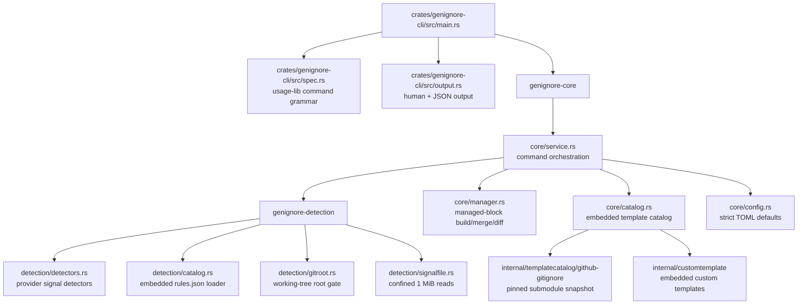

# Architecture

## System overview

`genignore` is a layered Rust CLI that analyzes the current working directory for provider signals, resolves a deterministic provider set, loads `.gitignore` template content from embedded `github/gitignore` snapshot data plus embedded local templates, and updates only the managed marker block in `.gitignore` so user-owned lines outside the markers are preserved.

The binary is built from a three-crate workspace with a strict dependency direction: `genignore-cli → genignore-core → genignore-detection`. The detection crate has no dependency on the other two.

## Component diagram


```mermaid
graph TD
  A[crates/genignore-cli/src/main.rs] --> B[crates/genignore-cli/src/spec.rs\nusage-lib command grammar]
  A --> C[crates/genignore-cli/src/output.rs\nhuman + JSON output]
  A --> D[genignore-core]
  D --> E[core/service.rs\ncommand orchestration]
  E --> F[genignore-detection]
  F --> G[detection/detectors.rs\nprovider signal detectors]
  F --> H[detection/catalog.rs\nembedded rules.json loader]
  F --> I[detection/gitroot.rs\nworking-tree root gate]
  F --> J[detection/signalfile.rs\nconfined 1 MiB reads]
  E --> K[core/manager.rs\nmanaged-block build/merge/diff]
  E --> L[core/catalog.rs\nembedded template catalog]
  E --> M[core/config.rs\nstrict TOML defaults]
  L --> N[internal/templatecatalog/github-gitignore\npinned submodule snapshot]
  L --> O[internal/customtemplate\nembedded custom templates]
```

## Data flow

1. Process entry starts in `crates/genignore-cli/src/main.rs`, which parses argv against the usage-lib spec in `spec.rs` and renders Cobra-compatible help and error output.
2. Before scanning or writing, `detect`, `add`, `resolve`, and `doctor` pass through `gitroot::require_worktree_root`, which requires the canonical current directory to equal the canonical `git rev-parse --show-toplevel`.
3. Commands delegate to `Service` methods in `genignore-core/src/service.rs`.
4. For detection, `Service` iterates detectors from `detection::registry()` in sorted key order, collecting `DetectionResult` entries and deriving matched providers. The scan target is the repository root plus its immediate (non-gitignored) subdirectories.
5. `Service::resolve_selection` merges detected providers with include/exclude/config-default inputs, then sorts to keep output stable.
6. `core/catalog.rs` loads template bodies entirely from checked-in content: the pinned `internal/templatecatalog/github-gitignore` submodule snapshot (compiled into the binary by `build.rs`, which fails the build when the snapshot is missing) plus embedded custom templates from `internal/customtemplate`.
7. `detection/catalog.rs` loads the embedded JSON repository-rule catalog used by repository-backed detectors and `doctor` diagnostics.
8. `core/manager.rs` builds a normalized managed block (`build_managed_block`) and upserts it into `.gitignore` (`upsert_managed_block`) as `created`, `updated`, `no-op`, or `dry-run`.
9. CLI output is rendered either as JSON (`--json`) or human-readable terminal output, including warnings, doctor diagnostics, provenance, and file action status.

For provider discovery commands, `core/service.rs` reads the embedded provider catalog, appends embedded custom provider keys, sorts/deduplicates, and optionally filters with substring matching for `search`.

## Key abstractions

- `fn main() -> ExitCode` — top-level CLI bootstrap, usage-lib parse, help/error surface, and command dispatch (`crates/genignore-cli/src/main.rs`).
- `const SPEC` / `fn spec()` — the command grammar (six commands plus global `--json`/`--verbose`/`-h`) consumed by usage-lib (`crates/genignore-cli/src/spec.rs`).
- `struct Service` — orchestration boundary combining config, detectors, embedded template catalog, and file manager (`genignore-core/src/service.rs`).
- `DetectOptions` / `AddOptions` / `ResolveOptions` — execution-time option structs passed from CLI to service.
- `struct Manager` + `build_managed_block` / `upsert_managed_block` / `preview_managed_block` — managed marker block assembly and safe merge semantics for `.gitignore` (`genignore-core/src/manager.rs`).
- `struct Config` + `load()` — strict TOML-backed machine defaults loader from `~/.config/genignore/config.toml`; unknown fields fail decode (`genignore-core/src/config.rs`).
- `type Detector` / `struct DetectionResult` — provider detection contract and normalized detection output (`genignore-detection/src/detectors.rs`, `src/lib.rs`).
- `fn registry(supported)` — detector registry built from hardcoded detectors plus JSON rule-catalog entries (`genignore-detection/src/detectors.rs`).
- `fn require_worktree_root(command, cwd)` — the Git working-tree root gate (`genignore-detection/src/gitroot.rs`).
- `fn read_signal_file` / `fn glob_in_root` — confined filesystem reads: project-relative paths, no symlink traversal, directories rejected, 1 MiB bound (`genignore-detection/src/signalfile.rs`).
- `fn load_rule_catalog(supported)` — embedded JSON detection-rule catalog loader and validator (`genignore-detection/src/catalog.rs`).
- `TEMPLATES` / `CUSTOM_TEMPLATES` / `DEFAULT_UPSTREAM_COMMIT` — the embedded template snapshot compiled in by `genignore-core/build.rs` plus pinned provenance (`genignore-core/src/catalog.rs`).

## Directory structure rationale

The repository uses a thin CLI crate over focused library crates so each concern (command surface, orchestration, detection, embedded catalog loading, and file mutation) remains isolated and testable.

```text
.
├── Cargo.toml               # Workspace root (members: crates/*)
├── crates/
│   ├── genignore-cli/       # usage-lib spec, help/error surface, output rendering, bin entrypoint
│   ├── genignore-core/      # service orchestration, config, managed-block engine, embedded catalogs
│   └── genignore-detection/ # detector registry, rule catalog, signal file reads, Git root gate
├── internal/
│   ├── rulecatalog/         # Embedded JSON rule catalog (rules.json)
│   ├── templatecatalog/     # github-gitignore submodule snapshot
│   └── customtemplate/      # Embedded custom templates
├── testdata/
│   ├── contracts/           # Byte-exact output contracts (detect/resolve/doctor/managed block)
│   └── repos/               # Minimal fixture repositories
├── docs/                    # Project documentation
└── .github/                 # CI/release automation metadata
```

This layout keeps command handling in `genignore-cli`, orchestration and mutation safety in `genignore-core`, and filesystem/provider inference in `genignore-detection`, minimizing coupling and keeping behavior deterministic.
